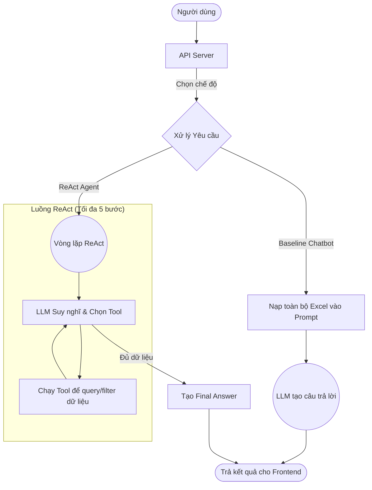

# System Flowchart: Chatbot vs ReAct Agent (Simplified)

Biểu đồ dưới đây miêu tả các bước chính yếu nhất trong luồng hoạt động của hệ thống.

```mermaid
graph TD
    User([Người dùng]) --> API[API Server]

    API --> |Chọn chế độ| Router{Xử lý Yêu cầu}

    %% Nhánh Baseline Chatbot
    Router -->|Baseline Chatbot| BasePrompt[Nạp toàn bộ Excel vào Prompt]
    BasePrompt --> BaseLLM((LLM tạo câu trả lời))
    BaseLLM --> UI([Trả kết quả cho Frontend])

    %% Nhánh ReAct Agent
    Router -->|ReAct Agent| ReActLoop((Vòng lặp ReAct))
    
    subgraph "Luồng ReAct (Tối đa 5 bước)"
        ReActLoop --> LLM_Think[LLM Suy nghĩ & Chọn Tool]
        LLM_Think --> Tool[Chạy Tool để query/filter dữ liệu]
        Tool --> LLM_Think
    end
    
    LLM_Think --> |Đủ dữ liệu| Final[Tạo Final Answer]
    Final --> UI([Trả kết quả cho Frontend])
```
